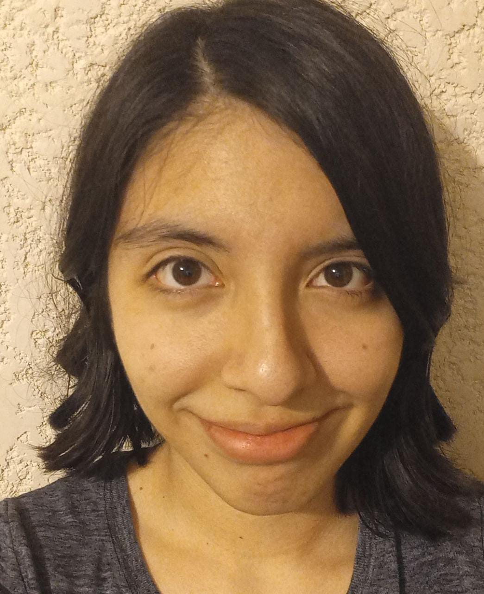

```{r setup, include=FALSE}
knitr::opts_chunk$set(echo = TRUE)
```



## Datos personales
- Fecha de nacimiento: 25/02/2002
- Licenciatura en ciencias genómicas en curso (2020-2023).

## Mis cursos
- Curso de programación de la licenciatura en ciencias genómicas (2020).
- Curso de computación de la licenciatura en ciencias genómicas (2021).
- Curso de Python de la licenciatura en ciencias genómicas (2021).
- Curso de R de la licenciatura en ciencias genómicas (2021).
- Curso de Biopython de la licenciatura en ciencias genómicas (2022).
- Curso de bioinformática de la licenciatura en ciencias genómicas (2020-2022).

## Contacto y redes sociales
- Correo: dgoretti@lcg.unam.mx, danigore22@gmail.com
- Facebook: Gore Castillo
- Twitter: @Danigore25
